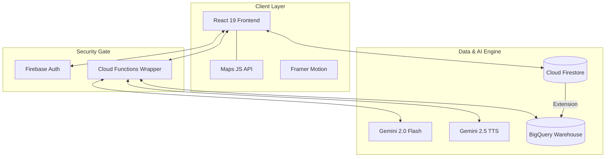

# VenueFlow AI 🏟️✨
### *Transforming Venue Congestion into Fluid Experiences with Agentic AI*

[](https://firebase.google.com/)
[](https://cloud.google.com/)
[](https://deepmind.google/technologies/gemini/)
[](https://react.dev/)

---

## 📖 The "Flash Crowd" Problem
At massive events (80k+ people), **seconds matter**. Sudden surges at gates or facilities lead to:
- ⚠️ **Safety Hazards**: Dangerous compression at entry/exit points.
- ⏳ **Economic Loss**: 40min+ wait times discourage facility usage.
- 📉 **Operational Blindness**: Staff are often reactive, not predictive.

**VenueFlow AI** solves this by creating a **Responsive Venue Ecosystem** that predicts surges 30 minutes before they happen.

---

## 🔥 Features at a Glance

### 📱 For Attendees (The Companion)
- **📍 Real-time Heatmaps**: Visualize density across 8+ stadium sectors.
- **🗺️ Intelligent AR Nav**: Avoid the crowd with AR-powered routing to low-density zones.
- **💬 Gemini Concierge**: Ask *"Where is the shortest line for tacos?"* or *"Fastest way to Gate B?"*
- **🔊 Accessible Voice**: Navigation commands read aloud via **Gemini 2.5 Flash TTS**.

### 🛠️ For Staff (The Orchestrator)
- **🤖 Agentic Tasking**: AI automatically generates and assigns tasks when density thresholds are breached.
- **📈 Predictive Analytics**: View AI-generated density forecasts for the next 30 minutes.
- **💬 Stealth Coordination**: Secure staff-only communications channel.

### 🏛️ For Admins (The Strategist)
- **📊 BigQuery Visualizer**: High-fidelity charts streaming directly from Firestore changelogs.
- **⏱️ Efficiency Tracker**: Monitor wait-time reduction and staff response speed.

### 🎮 Live Operations & Real-time Context
- **🔄 Live Motion Simulation**: Built-in system that simulates real-time attendee movement—ensuring the application is operational even during testing.
- **🌐 Global Sync Engine**: Orchestrates a unified state across Attendee, Staff, and Admin views, ensuring all analytics match the live map status instantly.
- **🔌 Zero-Config Prototyping**: Integrated live-data fallbacks allowing for a full feature experience even when offline or in limited connectivity environments.

---

## 🏗️ Technical Architecture



---

## 🛠️ The Google Stack

| Service | Role | Icon |
| :--- | :--- | :---: |
| **Gemini 2.0 Flash** | **The Brain**: Predictive surge analysis & agentic task generation. | 🧠 |
| **Gemini 2.5 TTS** | **The Voice**: Human-like navigation for accessibility. | 🗣️ |
| **Cloud Functions** | **The Shield**: Secure API proxying and rate-limiting. | 🛡️ |
| **Firestore** | **The Pulse**: Real-time state syncing for crowd data. | 💓 |
| **BigQuery** | **The Memory**: Historical analytics for venue optimization. | 📚 |
| **Maps JS API** | **The Canvas**: Interactive indoor stadium routing. | 🗺️ |

---

## 🔐 Security Architecture

- **Auth + RBAC Enforcement**: Firestore access is role-gated (`attendee`, `staff`, `admin`) via [firestore.rules](firestore.rules) and mirrored by callable function checks for sensitive analytics.
- **Server-side AI Guardrail**: Gemini prompts are validated and sanitized in Cloud Functions before model execution.
- **Least-Privilege Data Access**: Admin analytics are callable only by authenticated users with `admin` role.
- **Key Exposure Boundary**: Core Gemini inference keys remain server-only (`functions.config().gemini.key`). Frontend TTS uses optional public `VITE_GEMINI_API_KEY` only when enabled.
- **Client Security Metadata**: Referrer policy, content-type sniff protection, and feature permissions are set in [index.html](index.html).

---

## 🚀 Quick Start Guide

### 1️⃣ Clone & Install
```bash
git clone https://github.com/your-username/VenueFlow.git
cd VenueFlow
npm install
cd functions && npm install && cd ..
```

### 2️⃣ Environment Configuration
Create a `.env` file in the root:
```env
VITE_FIREBASE_API_KEY=your_key
VITE_FIREBASE_PROJECT_ID=your_id
VITE_GOOGLE_MAPS_API_KEY=your_maps_key
# Optional: required only if you want Gemini TTS voice playback in attendee chat
VITE_GEMINI_API_KEY=your_gemini_tts_key
```

### 3️⃣ Backend Deployment
```bash
# Set Gemini Key in Functions
firebase functions:config:set gemini.key="YOUR_GEMINI_API_KEY"

# Deploy Security Rules & Logic
firebase deploy --only functions,firestore:rules
```

---

## 🧪 Robust Testing Suite
Core logic quality is enforced with TypeScript checks, ESLint, Vitest coverage thresholds, and duplication detection.

```bash
npm test
```

Run the full quality gate used in CI/evaluation:

```bash
npm run quality:check
```

GitHub Actions enforces the same gate on every pull request and push via `.github/workflows/quality.yml`.

Run coverage directly:

```bash
npm run test:coverage
```

Run duplicate-code detection directly:

```bash
npm run quality:duplication
```

Run Firestore Security Rules emulator tests:

```bash
npm run test:rules
```

Run focused integration tests (admin analytics auth flow):

```bash
npm run test:integration
```

Run Cloud Functions callable authorization tests:

```bash
npm run test:functions-auth
```

Run Lighthouse CI with performance budgets:

```bash
npm run perf:lighthouse
```

Run the full submission gate (quality + build + functions + rules + lighthouse):

```bash
npm run check:full
```
- **Gemini Mocking**: Validates AI resilience during downtime.
- **Queue Logic**: Ensures wait-time calculations are frame-perfect.
- **RBAC Verification**: Confirms strict data isolation between roles.

---

## 🌍 Impact on SDG 11
By optimizing movement, we reduce idle time (and associated carbon footprint) and create safer, more inclusive public spaces. **VenueFlow AI makes cities smarter, one event at a time.**

---

**VenueFlow AI — Smart Venue Management**

---

## 🏆 Competition Context
**VenueFlow AI** was developed for the **Virtual Prompts** event conducted by **Hack2Skill**. The project serves as a comprehensive showcase of **Google Cloud Solutions** being used to solve real-world urban safety and congestion challenges.

---
